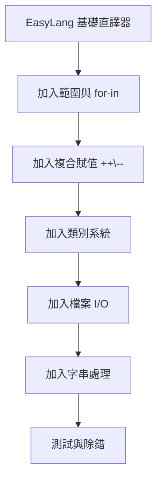

# 第十章：AI 輔助系統程式開發

## 10.1 AI 時代的系統程式開發

近年來，大型語言模型（LLM）的發展為軟體開發帶來了革命性的變化。AI 工具不僅能協助開發應用程式，在系統程式開發上也展現了驚人的能力。

### 常見的 AI 程式開發工具

| 工具 | 開發者 | 特點 |
|------|--------|------|
| OpenCode | 開源社群 | 開放原始碼，可自訂代理 |
| Claude Code | Anthropic | 強大的理解能力 |
| GitHub Copilot | GitHub/Microsoft | IDE 深度整合 |
| Codex CLI | OpenAI | 命令列介面 |
| Aider | 開源 | 支援多種 LLM |

## 10.2 使用 AI 開發系統程式

### 從需求到實作

使用 AI 開發系統程式的典型流程：


### 案例：用 AI 實作編譯器

以下是一個使用 AI 工具開發編譯器的實際案例：

**需求**：實作一個支援加減乘除和變數的簡單運算式編譯器

**給 AI 的提示**：

```
請用 Python 實作一個簡單的直譯器，支援：
1. 整數與浮點數
2. 四則運算 (+, -, *, /)
3. 變數賦值與讀取
4. if/else 條件判斷
5. while 迴圈

請使用遞迴下降剖析法，輸出為 AST 後直譯執行。
```

**AI 回應的關鍵決策**：
- 選擇 Python 作為實作語言
- 使用 dict 表示 AST 節點
- 使用遞迴下降剖析法
- 使用 Python 的 dict 實作作用域

### AI 輔助開發的最佳實踐

1. **明確的需求描述**：越具體的需求，AI 產生的結果越好
2. **逐步迭代**：先產生核心功能，再逐步擴充
3. **提供範例**：給 AI 看輸入/輸出範例，幫助理解
4. **審查程式碼**：AI 產生的程式碼需要人工審查
5. **撰寫測試**：讓 AI 產生測試案例，驗證正確性

## 10.3 提示工程技巧

### 寫出好的提示

```
❌ 不好的提示：
幫我寫一個直譯器

✅ 好的提示：
請用 Python 實作一個簡單的程式語言直譯器，包含以下功能：
1. 支援整數、浮點數、字串、布林值型態
2. 支援變數賦值與存取
3. 支援 if/else、while 流程控制
4. 支援自訂函式（含遞迴）
5. 使用 dict 作為 AST 節點
6. 使用遞迴下降剖析法
7. 包含 main() 函式從檔案讀取並執行
```

### 提示結構建議

```
[角色設定] 你是一位系統程式專家
[任務描述] 請實作一個 XXX
[技術要求] 使用 YYY 方法，支援 ZZZ 功能
[輸出格式] 請輸出完整的 Python 程式碼，包含註解
[範例] 以下是輸入/輸出範例：...
[限制] 不可以引入外部套件
```

### 常見模式

#### 修正錯誤

```
我的直譯器執行以下程式時出錯：
[貼上程式碼]
錯誤訊息是：[貼上錯誤]
請分析原因並修復
```

#### 加入新功能

```
請在現有的直譯器中加入類別系統：
- 支援 class 關鍵字定義類別
- 支援 new 關鍵字建立實例
- 支援 self 關鍵字
- 支援 obj.method() 方法呼叫

以下是現有的直譯器程式碼：
[貼上程式碼]
```

#### 程式碼審查

```
請審查以下直譯器程式碼，關注：
1. 潛在的 bug
2. 安全性問題
3. 效能瓶頸
4. 程式碼品質
[貼上程式碼]
```

## 10.4 實際案例：EasyLang3

EasyLang3 是使用 AI 工具（OpenCode + BigPickle）從 EasyLang 延伸擴充的直譯器專案。

### 開發過程



### 新增功能對照

| 功能 | 實作複雜度 | AI 協助程度 |
|------|-----------|-------------|
| 範圍運算子 `..` | 低 | 提供演算法 |
| 複合賦值 `+=` | 低 | 產生範例程式碼 |
| 類別系統 | 高 | 設計架構與實作 |
| 檔案 I/O | 中 | 產生完整的內建函式 |
| for-in 迴圈 | 中 | 設計 AST 節點與直譯邏輯 |

### 開發心得

1. **AI 適合重複性工作**：如新增內建函式、擴充運算子
2. **架構設計仍需人工**：AI 可以協助生成，但整體架構仍需人來設計
3. **測試不可省略**：AI 產生的程式碼常需要調整才能完全正確
4. **迭代開發最有效**：先求有再求好，逐步完善
5. **學習效果加倍**：閱讀 AI 產生的程式碼本身就是學習的過程

## 10.5 大規模專案開發

對於大型系統程式專案（如 c0computer），AI 的輔助策略更加複雜：

### 專案結構規劃

```c
c0computer/
├── compiler/      // 編譯器（C 語言）
│   ├── c0/        // C 編譯器
│   ├── py0/       // Python 編譯器
│   ├── ll0/       // LLVM IR 工具
│   ├── qd0/       // 四元組虛擬機
│   └── rv0/       // RISC-V 工具鏈
├── os/            // 作業系統
│   ├── xv6/       // 移植的 xv6
│   └── os0/       // 擴充版本
├── tool/          // 開發工具
│   ├── make0/     // 建置工具
│   ├── git0/      // 版本管理
│   └── pip0/      // 套件管理
├── ai/            // 人工智慧
│   ├── nn0/       // 神經網路
│   ├── gpt0/      // 語言模型
│   └── agent0/    // 代理人
└── web/           // 網路應用
    ├── webserver0/ // Web 伺服器
    └── fastapi0/  // API 框架
```

### 分階段開發策略

1. **第一階段**：用 AI 產生核心元件的雛型
2. **第二階段**：逐步完善每個元件的功能
3. **第三階段**：整合各元件，確保相容性
4. **第四階段**：效能最佳化與 Bug 修復

## 10.6 未來的展望

### AI 輔助開發的趨勢

1. **全自動程式生成**：從需求規格直接產生完整專案
2. **智慧型除錯**：AI 自動定位並修復程式錯誤
3. **程式碼最佳化**：AI 自動對程式碼進行效能最佳化
4. **跨語言轉換**：將程式碼從一種語言轉換為另一種
5. **文件自動生成**：從原始碼自動產生完整文件

### 給學習者的建議

1. **打好基礎**：理解系統程式的核心概念，才能判斷 AI 的輸出是否正確
2. **學會提問**：好的問題才能得到好的答案
3. **持續學習**：AI 工具在快速進步，保持學習的習慣
4. **動手實作**：親自寫程式仍然是學習的最佳方式
5. **批判思考**：不要盲目接受 AI 的輸出，要能辨識其優缺點

## 練習題

1. 請使用 AI 工具為你的直譯器加入一個新的功能（如 switch 陳述）
2. 請比較 AI 和手寫程式碼在品質和效率上的差異
3. 請使用不同的提示風格，觀察 AI 輸出結果的差異

## 本章重點

- AI 工具能顯著加速系統程式的開發
- 明確的需求描述是獲得良好結果的關鍵
- 提示工程（Prompt Engineering）是一項重要技能
- 架構設計仍需人工判斷
- AI 適合重複性工作，但測試和審查不可省略
- 結合 AI 效率與人類判斷力是最佳開發方式
